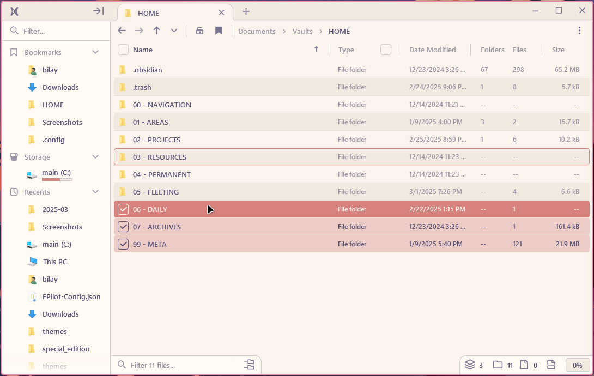
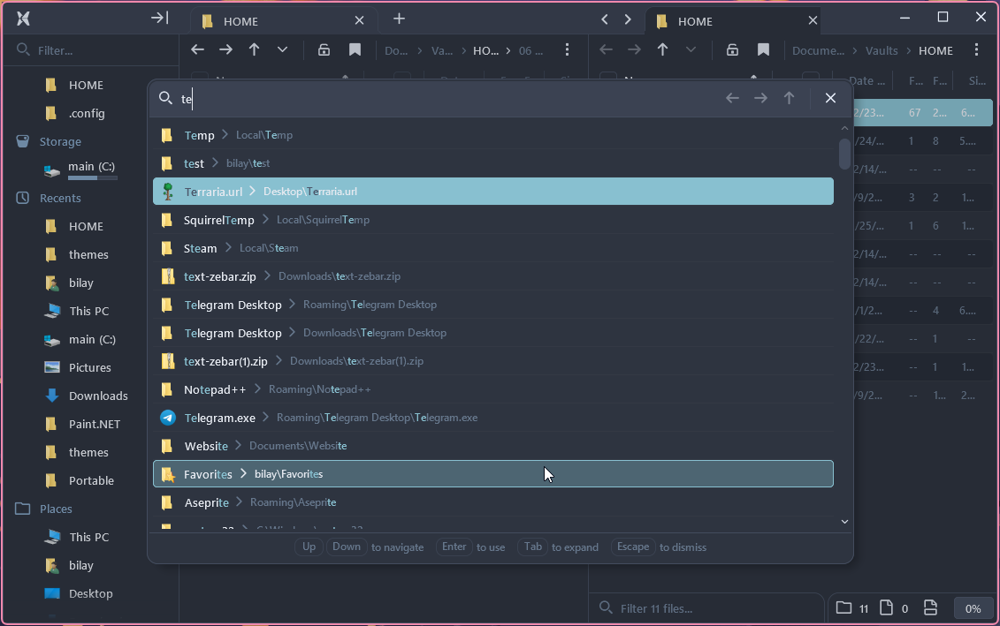

# [File Pilot](https://filepilot.tech/) themes
 

## Installation:

1. Open the `FPilot-Config.json` file (usually located in `%USERPROFILE%/AppData/Roaming/Voidstar/FilePilot/`)
2. Append the contents of your preffered theme's json file to the `"Color"` section
> [!IMPORTANT]
> Dont forget commas

**You can also install all themes by copying the contents of [`everything.json`](https://raw.githubusercontent.com/BilayJr/FPilot-themes/refs/heads/main/themes/everything.json)**
 
## Themes:

<a href="https://github.com/BilayJr/FPilot-themes/raw/refs/heads/main/themes/catppuccin.json" target="_blank">Catppuccin</a>

<a href="https://github.com/BilayJr/FPilot-themes/raw/refs/heads/main/themes/rosepine.json" target="_blank">Rose Pine</a>

<a href="https://github.com/BilayJr/FPilot-themes/raw/refs/heads/main/themes/nord.json" target="_blank">Nord</a>

<a href="https://github.com/BilayJr/FPilot-themes/raw/refs/heads/main/themes/gruvbox.json" target="_blank">Gruvbox</a>

<a href="https://github.com/BilayJr/FPilot-themes/raw/refs/heads/main/themes/dracula.json" target="_blank">Dracula</a>

<a href="https://github.com/BilayJr/FPilot-themes/raw/refs/heads/main/themes/pink.json" target="_blank">Pink</a>

## Contributing

**You can**
- Request a theme by using the `Theme Request` issue template
- Report a bug by using the `Bug Report` template
- Create an issue to suggest for something to be changed in the repo
- Make a PR with a theme of your own

***You should also join the [Voidstar Discord Server](https://filepilot.tech/discord) and share your themes in `#color-themes`***
